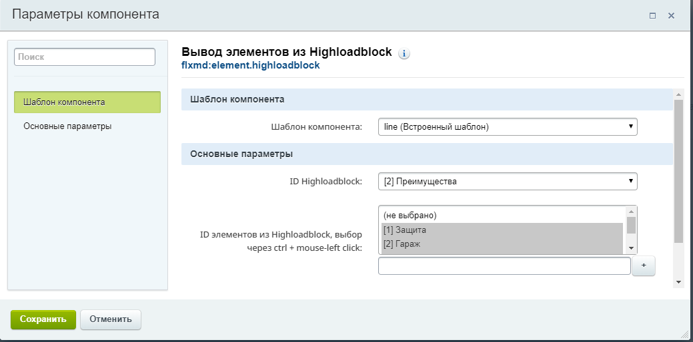

# Компонент 1С-Bitrix element.highloadblock
Компонент element.highloadblock выводит выбранные элементы из параметрах компонента

## Установка компонента
1. Скачайте репозиторий или клонируйте репозиторий
2. Раздел с названием element.highloadblock нужно загрузить на сайт по адресу /local/components/пространство имен/
3. Обновите компоненты в визуальном редакторе. Готово.

## Параметры компонентов
1. ID Highloadblock выводит все Highloadblock-ки в системе, принимает только один ID Highload-блока
2. ID элементов из Highloadblock, выбор через ctrl + mouse-left click. Может принимать массив ID элементов Highload-блока так же может принимать строку из ID элементов Highload-блока отделенными через запятую.

## Требования к системе для корректной работы
1. Редакция 1C-Bitrix не имеет значения
2. Версия 1C-Bitrix минимум 14.0
3. В Highload-блоке должен быть парметр название с кодом UF_NAME
